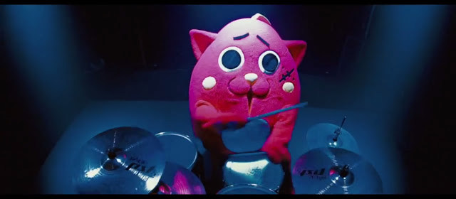
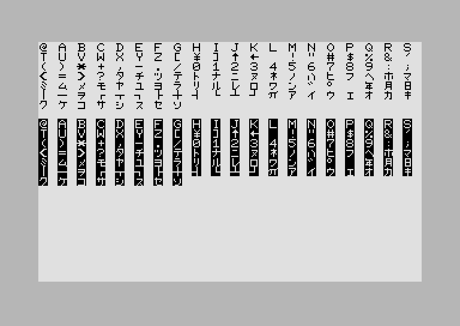
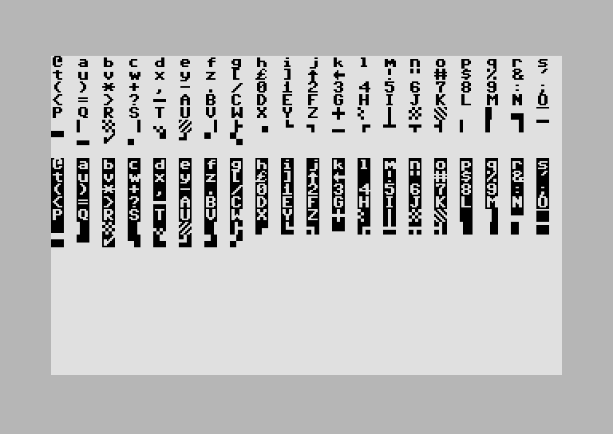

[«Upp](../text.html) • [Hem](../index.html) 
<small>Arkiv: [2019](2019.html) • [2018](2018.html) • [2017](2017.html) •
[2016](2016.html) • [2015](2015.html)</small>

# Ola Ekströms personliga blogg

## 23 augusti, 2021 Om personlig övertygelse

Jag var i Örebro i helgen, en stad som är större än Mjölby och som
följaktligen har utrymme för fler eklektiska
verklighetsuppfattningar. I anslutning till tågstationen satt ett
antal klistermärken med kritik mot Covid19-hanteringen, bland annat
ett med en teckning på. Det föreställde en enbent man med kryckor och
i en pratbubbla fanns texten (översatt från engelska)
”Kryckförsäljaren sa att vi behövde amputera.” Jag gissar att man
tänker på sin fixering vid de upplevda farorna med vaccinen (samtidigt
som man helt bagatelliserar farorna med Covid19). En ganska långsökt
jämförelse enligt mig och som synes av denna text tycker jag att
personerna bakom dessa lappar har fel (och inte så lite heller). Men
vi kan lämna det och istället betrakta situationen lite från ovan. Det
tycks mig som att de som eldigast kritiserar vaccinen är fullständigt
övertygade om sin sak. Allt tvivel lyser med sin frånvaro medan vi
andra känner en viss oro men försöker lyssna på dem vi tror vet bäst,
virologerna som arbetat med virus i decennier. Den gnagande oron
kommer av att vi vet att de kanske har fel men vi hoppas och tror att
de inte har det.

Jag tillåter mig själv att göra en till långsökt jämförelse (två fel
blir inte ett rätt, men det var inte jag som började 😉). Några andra
som var fullständigt övertygade om att ha rätt var de som åtalade och
brände så kallade häxor i Sverige på främst 1600-talet (tror jag). Jag
tror man får leta länge om man ska hitta någon som tycker de hade
rätt. Bevisen för kontakter med onda makter är fullständigt
skrattretande idag. Inte fullt lika kul är konsekvenserna av denna
tvärsäkerhet. Jag skulle vilja avsluta detta filosoferande med en
tankegång som jag fått för mig är vanlig inom zenbuddhismen; *”En vis
människa vet att hon ingenting vet.”*

---

## 19 augusti, 2021 Nyango Star

Mjölby har en förvuxen potatis som maskot, Kuroishi (黒石市) i
Aomori-prefekturen i Japan har Nyango Star. Hen verkar ha varit aktiv
sedan 2015 och är enligt legenden anden från en död katt som tagit sin
boning i ett äpple (Aomori är känt för sina äpplen). Förutom detta är
Nyango Star en fena på trummor, både som soloartist och som trummis i
maskotmetalbandet Charamel.

Relaterade länkar:  
Nyango Star Live: [https://www.youtube.com/watch?v=QZShA_a-5r8](https://www.youtube.com/watch?v=QZShA_a-5r8)  
Charamel: [https://www.youtube.com/watch?v=KGOKCemSITc](https://www.youtube.com/watch?v=KGOKCemSITc)

## 14 december, 2020 Television, en riksdrog?

En av det sena 80-talets mest allsångsvänliga låtar är inte som man
kanske kan tro *I Should Be So Lucky* med Kylie Minogue eller *Den
makalösa manicken* utan *Television: The Drug of the Nation* med
hardcore/industri/hiphop/vinkelslipkollektivet **The Beatnigs**
(sedemera omformat till hiphoparna The Disposable Heroes of Hiphoprisy
(säg det tio gånger snabbt)). Om denna låt skulle skrivas idag skulle
man kanske inte utse TV som det medium som reser murar mellan
människor och föder okunskap utan det du använder nu. Det har genom
tiderna i och för sig flera gånger utsetts olika medier som kommer att
bringa ungdomen eller kvinnor i fördärvet (serietidningar, romaner),
därmed inte sagt att kritiken ibland inte är berättigad.

Hursomhelst, i texten till låten görs ett antal påståenden bland annat
att popkonst (pop art) skulle vara en självmotsägelse (om man nu inte
säger "pop tart" vilket skulle göra mig ytterligt förvirrad 😆). Kan
inte konst vara populär alltså? Det tror jag nog att den kan
vara. Därmed inte sagt att man behöver diskutera den djupare
innebörden av *Gammal fiskargubbe* eller *Gråtande barn* någon längre
stund.

## 25 april, 2020 Area51.wad och Techwear

Satt och spelade en WAD till *Doom2* (fast jag använder *Freedoom* för
jag gillar frihet 😉) som heter [*Area
51*](https://www.doomworld.com/files/file/8220-area-51/) och mot
slutet av bana 1 hittade jag den här gamla bekantingen på väggen:

Det är **Smoking Man** från *Arkiv X*. Det var inte igår man såg till
honom. Denna WAD är från 1997 så det är inte så konstigt att han är
med, Arkiv X var mer i ropet på den tiden.

*Techwear* är en term som jag precis har stött på när jag läste om en
extremt dyr jacka inspirerad av spelet *Death Stranding* som sålde
slut på nolltid trots att den kostar €1750 (japp det är omkring 17500
kr). Det är en typ av mode som marknadsförs i termer av smarta
material och framtidskläder och har vissa beröringspunkter med
*cyberpunkmode*. Man ser ut som man har varit och handlat på
Nationella insatsstyrkans second hand fast några år in i
framtiden. Det är mycket remmar och fickor med oklar funktion.

Folk intresserade av cyberpunk verkar dock kritiska eftersom det inte
är särskilt mycket punk med kläder som kostar större delen av en
månadslön efter skatt (beroende på inkomst). Techwear har hur som
helst en egen subreddit om man är intresserad.

Relaterade länkar:  
[https://www.wad-archive.com/wad/Area-51](https://www.wad-archive.com/wad/Area-51)  
[https://kotaku.com/1900-death-stranding-jacket-released-sells-out-instan-1842949514](https://kotaku.com/1900-death-stranding-jacket-released-sells-out-instan-1842949514)

## 8 april, 2020 C64.JP

De som känner mig närmare vet att jag är fascinerad av gamla
datorburkar. Därav denna lilla utflykt i teknikhistorien.

På 80-talet gjorde Commodore ett försök att lansera sin hemdator C64
(även känd som VIC / Commodore 64) i Japan. Den hade gjort stor succé
i USA men i Japan fick man ge upp ganska snart på grund av den hårda
konkurrensen från inhemska datortillverkare. Den japanska modellen är
lik den västerländska förutom skillnader i kernal och teckengeneratorn
(det man kanske skulle kalla för firmware på nyare maskiner). Sätter
man på en japansk C64 märker man att färgerna på BASIC-skärmen är
annorlunda och att mängden ledigt minne skiftar. Tangentbordet är
också annorlunda. Man har bytt tangenten shift-lock mot commodore-lock
och tecknet för pund (£) som finns på västmaskinerna har ersatts av
det i Japan mer användbara tecknet för yen (¥). På sidan av
tangenterna har man istället för bilder på de grafiska tecken man kan
få fram på västmaskiner avbildningar av katakanatecken. Katakana är
ett av de skriftsystem man använder i Japan och används bland annat
för låneord och tekniska termer.

Detta är alla tecken man kan få fram på en japansk modell när man
väljer stora bokstäver/katakanaläget:

Som jämförelse är här den västerländska (anglosaxiska) uppsättningen
när man valt läget för stora och små bokstäver:

Vi ser att man ersatt de små bokstäverna med de stora från det
latinska alfabetet och på de storas plats kommer katakanatecknen. Det
japanska typsnittet är också mycket tunnare. Vad det kan bero på törs
jag inte spekulera om.

Vill man leka med en japansk C64 utan att köpa en (de ska vara ganska
sällsynta/dyra på auktionssiter) går det att emulera en i VICE. Man
väljer bara en i inställningarna för modell i *machine settings*. När
jag prövar kan jag inte ladda program från den virtuella diskdriven, i
alla fall inte med fastload. Får testa mera vid tillfälle.

Källor/relaterade länkar:  
[https://monochromeeffect.org/wp/2018/03/23/japanese-commodore-64/](https://monochromeeffect.org/wp/2018/03/23/japanese-commodore-64/)  
[http://www.zimmers.net/cbmpics/c64js.html](http://www.zimmers.net/cbmpics/c64js.html)  

